```
    .___                    __
  __| _/_  _  _____________|  | __ ___________  ______
 / __ |\ \/ \/ /  _ \_  __ \  |/ // __ \_  __ \/  ___/
/ /_/ | \     (  <_> )  | \/    <\  ___/|  | \/\___ \
\____ |  \/\_/ \____/|__|  |__|_ \\___  >__|  /____  >
     \/                         \/    \/           \/

        Digital Workers as a Service (DWaaS)
```

[](https://www.python.org/downloads/)
[](LICENSE)
[]()

**AI-powered digital workers for consulting firms, built on fireflyframework-genai.**

---

## Table of Contents

- [Why dworkers?](#why-dworkers)
- [Business Value](#business-value)
- [Architecture](#architecture)
- [Features](#features)
- [Productivity Tools](#productivity-tools)
- [Quick Start](#quick-start)
- [Installation](#installation)
- [CLI Usage](#cli-usage)
- [Configuration](#configuration)
- [Development](#development)
- [Project Structure](#project-structure)
- [License](#license)

---

## Why dworkers?

Consulting firms face a persistent challenge: scaling expertise without linearly scaling headcount. firefly-dworkers addresses this by providing **Digital Workers as a Service (DWaaS)** -- AI agents purpose-built for consulting workflows.

- **36% productivity optimization** -- Turn 1 FTE into 1.26 FTE effective capacity through intelligent task execution.
- **Four specialized worker roles** -- Analyst, Researcher, Data Analyst, and Manager, each with domain-tuned instructions and toolkits.
- **Industry verticals** -- Pre-configured knowledge for banking, healthcare, technology, gaming, legal, and consumer sectors.
- **DAG-based plan templates** -- Reusable multi-step workflows for common engagements (market analysis, customer segmentation, process improvement, technology assessment).
- **Multi-tenant by design** -- Onboard new clients with a YAML file. No code changes required.
- **Configurable autonomy** -- From fully manual (human approves every step) to fully autonomous, with semi-supervised as the default.
- **Pluggable connectors** -- Swap Tavily for SerpAPI, SharePoint for Google Drive, or Slack for Teams through configuration alone.

---

## Business Value

### For Consulting Firms

firefly-dworkers is designed for the economics of professional services. The platform maps directly to how consulting firms staff, bill, and deliver engagements:

| Traditional Model | With Digital Workers |
|-------------------|----------------------|
| 1 analyst at $150/hr billing rate | 1 analyst + DWorker at $150/hr + ~$2/hr API cost |
| 40 hrs/week effective capacity | 50+ hrs/week equivalent output |
| 5-day turnaround on market scans | Same-day research briefs |
| Manual PowerPoint and Excel assembly | Auto-generated deliverables from analysis |

### Use Cases

**Market Entry Analysis** — A partner asks "Should we enter the AI advisory market?"
1. **ResearcherWorker** gathers competitive landscape, market sizing, and regulatory context
2. **DataAnalystWorker** analyzes financial data and builds projection models
3. **AnalystWorker** synthesizes findings into strategic recommendations
4. **PowerPointTool** generates the client-ready strategy deck

**Client Onboarding** — A new engagement kicks off:
1. `dworkers init acme-corp` scaffolds the tenant configuration
2. Connectors are configured (SharePoint for document access, Jira for task tracking, Slack for communications)
3. Workers are assigned autonomy levels based on the engagement's risk profile
4. The Manager worker oversees plan execution with checkpoint approvals

**Recurring Reporting** — Monthly deliverables on autopilot:
1. A `market-analysis` plan template runs on schedule
2. Workers pull fresh data from configured sources
3. Reports are generated as Word documents or PowerPoint decks
4. Results are posted to Slack and filed in SharePoint

### Industry Verticals

Each vertical provides domain-tuned system prompts so workers understand sector-specific terminology, regulations, and best practices:

| Vertical | Focus Areas |
|----------|-------------|
| Banking | Risk frameworks, Basel III/IV, AML/KYC, fintech disruption |
| Healthcare | HIPAA compliance, clinical workflows, payer-provider dynamics |
| Technology | Cloud migration, SaaS metrics, engineering productivity |
| Gaming | LiveOps, player economics, platform compliance (ESRB, PEGI) |
| Legal | Contract analysis, regulatory mapping, litigation support |
| Consumer | Brand strategy, retail analytics, supply chain optimization |

---

## Architecture

firefly-dworkers follows a **hexagonal architecture** (ports and adapters) layered on top of fireflyframework-genai:

```mermaid
graph TB
    subgraph "Application Layer"
        CLI["CLI (Typer + Rich)"]
        API["REST API (FastAPI)"]
        SDK["SDK (Sync + Async)"]
    end

    subgraph "Orchestration Layer"
        Plans["Plans (DAG Templates)"]
        PB["PlanBuilder"]
        Autonomy["Autonomy + Checkpoints"]
    end

    subgraph "Worker Layer"
        WF["WorkerFactory"]
        Analyst["AnalystWorker"]
        Researcher["ResearcherWorker"]
        DataAnalyst["DataAnalystWorker"]
        Manager["ManagerWorker"]
    end

    subgraph "Tool Layer (Ports)"
        WST["WebSearchTool"]
        WBT["WebBrowsingTool"]
        DST["DocumentStorageTool"]
        MT["MessageTool"]
        PMT["ProjectManagementTool"]
        CT["ConsultingTool"]
    end

    subgraph "Adapters"
        Tavily["TavilySearchTool"]
        SerpAPI["SerpAPISearchTool"]
        WB["WebBrowserTool"]
        FB["FlyBrowserTool"]
        SP["SharePointTool"]
        GD["GoogleDriveTool"]
        Conf["ConfluenceTool"]
        S3A["S3Tool"]
        Slack["SlackTool"]
        Teams["TeamsTool"]
        Email["EmailTool"]
        Jira["JiraTool"]
        Asana["AsanaTool"]
        RG["ReportGenerationTool"]
        PM["ProcessMappingTool"]
        GA["GapAnalysisTool"]
        RQ["RequirementGatheringTool"]
        Doc["DocumentationTool"]
    end

    subgraph "Cross-Cutting"
        TR["ToolRegistry"]
        Tenants["TenantConfig (YAML)"]
        Knowledge["KnowledgeRepository"]
        Verticals["Verticals"]
    end

    CLI --> Plans
    API --> Plans
    SDK --> API
    Plans --> PB
    PB --> WF
    WF --> Analyst & Researcher & DataAnalyst & Manager
    Analyst & Researcher & DataAnalyst & Manager --> WST & WBT & DST & MT & PMT & CT
    WST --> Tavily & SerpAPI
    WBT --> WB & FB
    DST --> SP & GD & Conf & S3A
    MT --> Slack & Teams & Email
    PMT --> Jira & Asana
    CT --> RG & PM & GA & RQ & Doc
    TR --> Tavily & SerpAPI & WB & FB & SP & GD & Conf & S3A & Slack & Teams & Email & Jira & Asana & RG & PM & GA & RQ & Doc
    Tenants --> WF
    Knowledge --> Analyst & Researcher
    Verticals --> Analyst & Researcher & DataAnalyst & Manager
    Autonomy --> Plans
```



**Key patterns:**

- **Ports** = Abstract base classes (`WebSearchTool`, `WebBrowsingTool`, `DocumentStorageTool`, `MessageTool`, `ProjectManagementTool`, `ConsultingTool`)
- **Adapters** = Concrete implementations (`TavilySearchTool`, `SerpAPISearchTool`, `WebBrowserTool`, `FlyBrowserTool`, `SharePointTool`, `GoogleDriveTool`, `ConfluenceTool`, `S3Tool`, `SlackTool`, `TeamsTool`, `EmailTool`, `JiraTool`, `AsanaTool`, plus five consulting tools)
- **Registry** = `ToolRegistry` with `@tool_registry.register()` decorators for self-registration
- **Factory** = `WorkerFactory` with `@worker_factory.register()` decorators for worker class creation

See [docs/architecture.md](docs/architecture.md) for a deep dive.

---

## Features

- **Workers** -- Four specialized AI agents (Analyst, Researcher, Data Analyst, Manager) with vertical-aware instruction building
- **Tools** -- 20+ pluggable connectors across web search, storage, communication, project management, and consulting domains
- **Plans** -- DAG-based workflow templates with dependency resolution, retry policies, and timeout support
- **Knowledge** -- Document indexing and retrieval with pluggable `KnowledgeBackend` protocol
- **Tenants** -- Multi-tenant configuration via YAML/JSON with per-tenant models, connectors, and worker settings
- **Verticals** -- Industry-specific system prompt fragments for six sectors
- **Autonomy** -- Three levels (manual, semi_supervised, autonomous) with checkpoint handling
- **SDK** -- Synchronous and asynchronous Python clients for programmatic access
- **Server** -- FastAPI REST API with OpenAPI documentation
- **CLI** -- `dworkers` command with `init`, `serve`, `install`, and `check` subcommands

---

## Productivity Tools

Digital workers can generate Office documents directly from analysis results. Each tool provides a two-tier API:

- **`execute()`** — Returns metadata (`{"bytes_length": N, "success": True}`) for LLM tool calling
- **`create()` / `generate()`** — Returns raw file bytes for programmatic use
- **`create_and_save()`** — Generates and writes the file in one call
- **`artifact_bytes`** — Retrieves bytes from the last `execute()` call

| Tool | Formats | Key Methods |
|------|---------|-------------|
| `PresentationTool` | `.pptx` (PowerPoint, Google Slides) | `create()`, `create_and_save()`, `modify()`, `modify_and_save()` |
| `DocumentTool` | `.docx` (Word, Google Docs) | `create()`, `create_and_save()`, `modify()`, `modify_and_save()` |
| `SpreadsheetPort` | `.xlsx` (Excel, Google Sheets) | `create()`, `create_and_save()`, `modify()`, `modify_and_save()` |
| `PDFTool` | `.pdf` (from Markdown/HTML) | `generate()`, `generate_and_save()` |

```python
from firefly_dworkers.tools.presentation.powerpoint import PowerPointTool
from firefly_dworkers.tools.presentation.models import SlideSpec

ppt = PowerPointTool()
path = await ppt.create_and_save(
    "strategy_deck.pptx",
    slides=[
        SlideSpec(title="Executive Summary", bullet_points=["Market is growing 23% YoY", "Three acquisition targets identified"]),
        SlideSpec(title="Recommendations", content="Prioritize organic growth in Q3-Q4."),
    ],
)
print(f"Deck saved to {path}")
```

---

## Quick Start

```bash
# Install via the interactive installer
curl -fsSL https://raw.githubusercontent.com/fireflyresearch/firefly-dworkers/main/install.sh | bash

# Or install non-interactively with the full profile
curl -fsSL https://raw.githubusercontent.com/fireflyresearch/firefly-dworkers/main/install.sh | bash -s -- --yes --profile full

# Initialize a new project
dworkers init my-project

# Start the server
dworkers serve
```

### Try the Examples

If you have an Anthropic API key, you can run the working examples directly:

```bash
export ANTHROPIC_API_KEY="sk-ant-..."
uv run python examples/01_basic_analyst.py
```

See the [examples/](examples/) directory for six runnable scripts covering
workers, plans, streaming, and productivity tool usage. Example 06 demonstrates
end-to-end presentation generation using the public `create_and_save()` API.

---

## Installation

Install via the interactive TUI installer:

```bash
curl -fsSL https://raw.githubusercontent.com/fireflyresearch/firefly-dworkers/main/install.sh | bash
```

The installer bootstraps `uv`, creates an isolated Python 3.13 virtual environment, and lets you choose a profile:

| Profile | What it installs |
|---------|------------------|
| **Minimal** | Core library + CLI |
| **Analyst** | + web search, data processing, presentation generation |
| **Server** | + FastAPI server, CLI, web search |
| **Full** | All 14 optional extras |
| **Custom** | Pick individual extras interactively |

Non-interactive install (for CI or scripts):

```bash
curl -fsSL https://raw.githubusercontent.com/fireflyresearch/firefly-dworkers/main/install.sh | bash -s -- --yes --profile full
```

To uninstall:

```bash
dworkers-uninstall
```

---

## CLI Usage

The `dworkers` CLI is built with Typer and Rich.

```bash
# Show version and banner
dworkers --version

# Initialize a new project with tenant config scaffolding
dworkers init my-project

# Start the API server (default: http://0.0.0.0:8000)
dworkers serve

# Install optional dependencies for a connector
dworkers install sharepoint

# Check environment, dependencies, and configuration
dworkers check
```

See [docs/cli-reference.md](docs/cli-reference.md) for the complete reference.

---

## Configuration

Each tenant is configured via a YAML file in the tenant config directory:

```yaml
# config/tenants/acme-corp.yaml
id: acme-corp
name: Acme Corporation

models:
  default: openai:gpt-4o
  research: anthropic:claude-sonnet-4-20250514

verticals:
  - banking
  - technology

workers:
  analyst:
    autonomy: semi_supervised
    custom_instructions: "Focus on risk assessment and regulatory compliance."
  researcher:
    autonomy: autonomous
  data_analyst:
    autonomy: semi_supervised
  manager:
    autonomy: manual

connectors:
  web_search:
    enabled: true
    provider: tavily
    api_key: "${TAVILY_API_KEY}"
  sharepoint:
    enabled: true
    tenant_id: "${AZURE_TENANT_ID}"
    client_id: "${SP_CLIENT_ID}"
    client_secret: "${SP_CLIENT_SECRET}"
    site_url: "https://acmecorp.sharepoint.com/sites/consulting"
  slack:
    enabled: true
    bot_token: "${SLACK_BOT_TOKEN}"
    default_channel: "#consulting-ops"
  jira:
    enabled: true
    base_url: "https://acmecorp.atlassian.net"
    username: "${JIRA_USERNAME}"
    api_token: "${JIRA_API_TOKEN}"
    project_key: CONSULT

branding:
  company_name: Acme Corporation
  report_template: default

security:
  allowed_models:
    - "openai:*"
    - "anthropic:*"
  data_residency: us-east-1
```

See [docs/configuration.md](docs/configuration.md) for the complete reference.

---

## Development

### Setup

```bash
# Clone the repository
git clone https://github.com/fireflyresearch/firefly-dworkers.git
cd firefly-dworkers

# Install with dev dependencies using uv
uv sync --all-extras
```

### Testing

```bash
# Run all tests
uv run pytest tests/ -v

# Run with coverage
uv run pytest tests/ --cov=firefly_dworkers --cov=firefly_dworkers_server

# Run a specific test module
uv run pytest tests/test_workers/test_factory.py -v
```

### Linting and Type Checking

```bash
# Lint with ruff
uv run ruff check src/ tests/

# Format with ruff
uv run ruff format src/ tests/

# Type check with pyright
uv run pyright
```

---

## Project Structure

```
firefly-dworkers/
|-- pyproject.toml
|-- README.md
|-- examples/           (runnable scripts with Anthropic Claude API)
|-- docs/
|   |-- index.md
|   |-- architecture.md
|   |-- getting-started.md
|   |-- configuration.md
|   |-- cli-reference.md
|   |-- api-reference.md
|   |-- contributing.md
|   |-- workers/          (overview, custom-workers)
|   |-- tools/            (overview, registry)
|   |-- plans/            (overview, custom-plans, templates)
|   |-- knowledge/        (overview)
|   |-- verticals/        (overview)
|   |-- sdk/              (overview)
|   |-- tenants/          (overview)
|   |-- autonomy/         (overview)
|-- src/
|   |-- firefly_dworkers/
|   |   |-- __init__.py
|   |   |-- _version.py
|   |   |-- config.py
|   |   |-- exceptions.py
|   |   |-- types.py
|   |   |-- autonomy/
|   |   |   |-- __init__.py
|   |   |   |-- checkpoint.py
|   |   |   |-- levels.py
|   |   |   |-- reviewer.py
|   |   |-- knowledge/
|   |   |   |-- __init__.py
|   |   |   |-- backends.py
|   |   |   |-- indexer.py
|   |   |   |-- repository.py
|   |   |   |-- retriever.py
|   |   |-- plans/
|   |   |   |-- __init__.py
|   |   |   |-- base.py
|   |   |   |-- builder.py
|   |   |   |-- registry.py
|   |   |   |-- templates/
|   |   |       |-- __init__.py
|   |   |       |-- customer_segmentation.py
|   |   |       |-- market_analysis.py
|   |   |       |-- process_improvement.py
|   |   |       |-- technology_assessment.py
|   |   |-- sdk/
|   |   |   |-- __init__.py
|   |   |   |-- async_client.py
|   |   |   |-- client.py
|   |   |   |-- models.py
|   |   |-- tenants/
|   |   |   |-- __init__.py
|   |   |   |-- config.py
|   |   |   |-- context.py
|   |   |   |-- loader.py
|   |   |   |-- registry.py
|   |   |-- tools/
|   |   |   |-- __init__.py
|   |   |   |-- registry.py
|   |   |   |-- toolkits.py
|   |   |   |-- communication/
|   |   |   |   |-- __init__.py
|   |   |   |   |-- base.py
|   |   |   |   |-- slack.py
|   |   |   |   |-- teams.py
|   |   |   |   |-- email.py
|   |   |   |-- consulting/
|   |   |   |   |-- __init__.py
|   |   |   |   |-- base.py
|   |   |   |   |-- report_generation.py
|   |   |   |   |-- process_mapping.py
|   |   |   |   |-- gap_analysis.py
|   |   |   |   |-- requirement_gathering.py
|   |   |   |   |-- documentation.py
|   |   |   |-- data/
|   |   |   |   |-- __init__.py
|   |   |   |   |-- csv_excel.py
|   |   |   |   |-- sql.py
|   |   |   |   |-- api_client.py
|   |   |   |-- project/
|   |   |   |   |-- __init__.py
|   |   |   |   |-- base.py
|   |   |   |   |-- jira.py
|   |   |   |   |-- asana.py
|   |   |   |-- storage/
|   |   |   |   |-- __init__.py
|   |   |   |   |-- base.py
|   |   |   |   |-- sharepoint.py
|   |   |   |   |-- google_drive.py
|   |   |   |   |-- confluence.py
|   |   |   |   |-- s3.py
|   |   |   |-- web/
|   |   |       |-- __init__.py
|   |   |       |-- search.py
|   |   |       |-- browsing.py
|   |   |       |-- tavily.py
|   |   |       |-- serpapi.py
|   |   |       |-- browser.py
|   |   |       |-- flybrowser.py
|   |   |       |-- rss.py
|   |   |-- verticals/
|   |   |   |-- __init__.py
|   |   |   |-- base.py
|   |   |   |-- banking.py
|   |   |   |-- healthcare.py
|   |   |   |-- technology.py
|   |   |   |-- gaming.py
|   |   |   |-- legal.py
|   |   |   |-- consumer.py
|   |   |-- workers/
|   |       |-- __init__.py
|   |       |-- base.py
|   |       |-- factory.py
|   |       |-- registry.py
|   |       |-- analyst.py
|   |       |-- researcher.py
|   |       |-- data_analyst.py
|   |       |-- manager.py
|   |-- firefly_dworkers_server/
|   |   |-- __init__.py
|   |   |-- __main__.py
|   |   |-- app.py
|   |   |-- api/
|   |       |-- __init__.py
|   |       |-- workers.py
|   |       |-- plans.py
|   |       |-- tenants.py
|   |       |-- knowledge.py
|   |-- firefly_dworkers_cli/
|       |-- __init__.py
|       |-- __main__.py
|       |-- app.py
|       |-- commands/
|       |   |-- __init__.py
|       |   |-- init.py
|       |   |-- serve.py
|       |   |-- install.py
|       |   |-- check.py
|       |-- ui/
|           |-- __init__.py
|           |-- banner.py
|           |-- panels.py
|-- tests/
    |-- conftest.py
    |-- test_config.py
    |-- test_types.py
    |-- test_workers/
    |-- test_tools/
    |-- test_plans/
    |-- test_tenants/
    |-- test_knowledge/
    |-- test_sdk/
    |-- test_server/
    |-- test_cli/
    |-- test_autonomy/
    |-- test_verticals/
    |-- test_integration/
```

---

## License

Licensed under the [Apache License 2.0](LICENSE).

Copyright 2026 Firefly Research.
