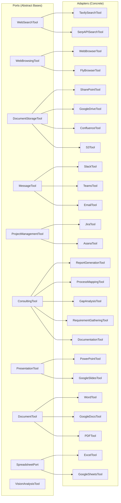
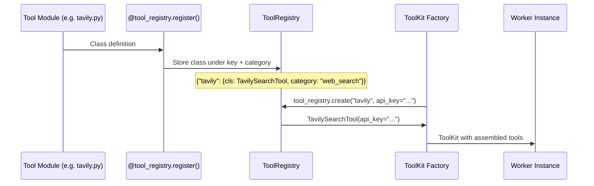
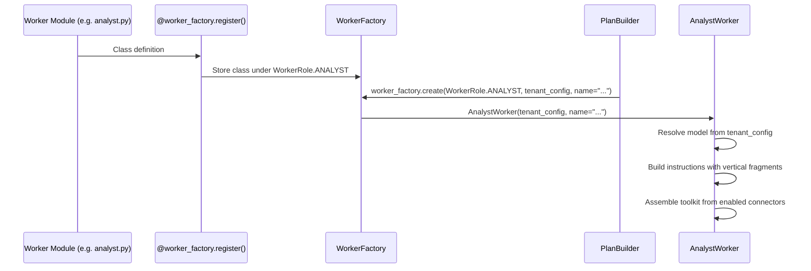
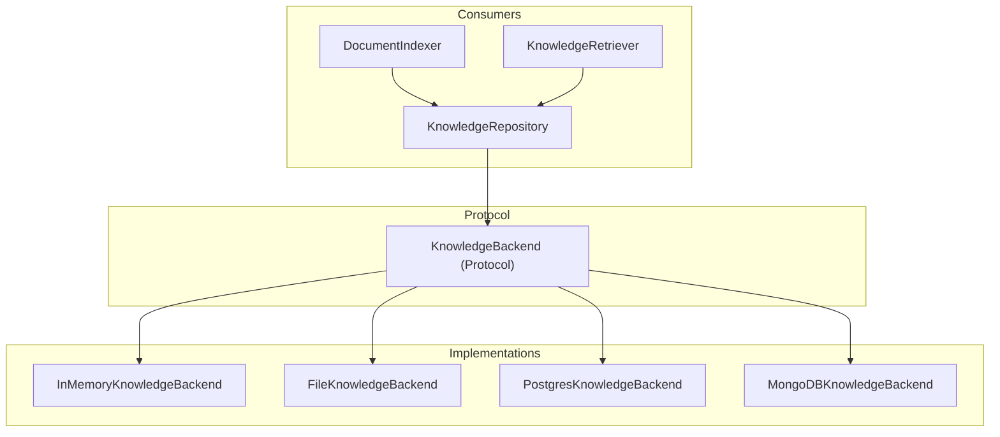
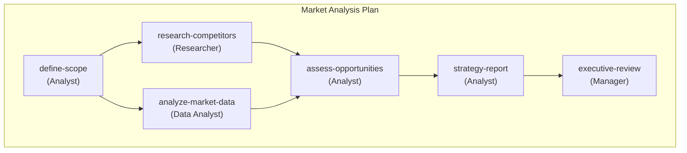
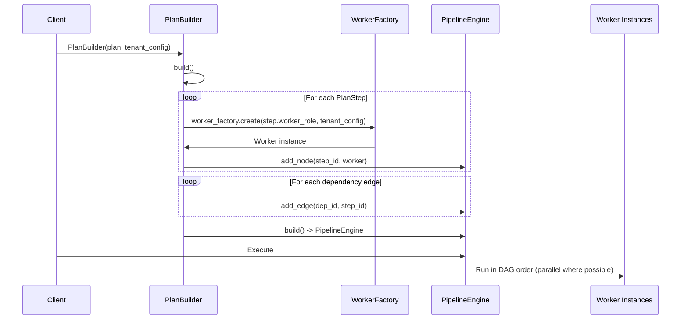
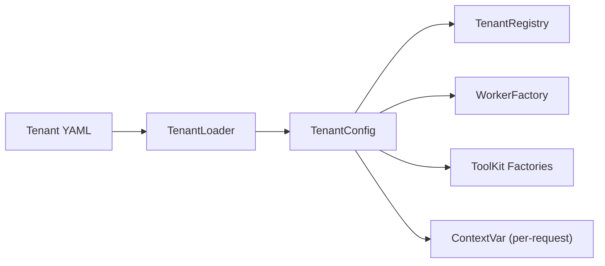
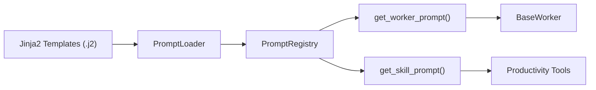

# Architecture

## Contents

- [Layered Overview](#layered-overview)
- [Three Packages, One Repository](#three-packages-one-repository)
- [Port / Adapter Pattern](#port--adapter-pattern)
  - [Port Definitions](#port-definitions)
- [ToolRegistry Flow](#toolregistry-flow)
- [WorkerFactory Flow](#workerfactory-flow)
- [Knowledge Backend Protocol](#knowledge-backend-protocol)
- [Plan DAG Execution](#plan-dag-execution)
- [Tenant Configuration Flow](#tenant-configuration-flow)
- [Prompt Management](#prompt-management)
- [Guards and Observability](#guards-and-observability)
- [Dependency on fireflyframework-genai](#dependency-on-fireflyframework-genai)
- [Threading and Concurrency](#threading-and-concurrency)

---

firefly-dworkers is structured as a **hexagonal architecture** (ports and adapters) built on top of fireflyframework-genai. This document provides a detailed walkthrough of each architectural layer and the key patterns used throughout the system.

---

## Layered Overview

The platform is organized into distinct layers, each with clear responsibilities:

```
+-----------------------------------------------------------+
|                  APPLICATION LAYER                         |
|  firefly_dworkers_server  |  firefly_dworkers_cli         |
|  REST API (FastAPI)       |  CLI (Typer + Rich)           |
+-----------------------------------------------------------+
                            |
+-----------------------------------------------------------+
|                  SDK LAYER                                 |
|  DworkersClient  |  AsyncDworkersClient  |  Models        |
+-----------------------------------------------------------+
                            |
+-----------------------------------------------------------+
|                  ORCHESTRATION LAYER                       |
|  Plans (DAG Templates)  |  PlanBuilder  |  Autonomy       |
+-----------------------------------------------------------+
                            |
+-----------------------------------------------------------+
|                  WORKER LAYER                              |
|  BaseWorker  |  WorkerFactory  |  WorkerRegistry          |
|  AnalystWorker  |  ResearcherWorker  |  DataAnalystWorker  |
|  ManagerWorker                                            |
+-----------------------------------------------------------+
                            |
+-----------------------------------------------------------+
|                  TOOL LAYER                                |
|  ToolRegistry  |  ToolKits  |  Ports + Adapters           |
+-----------------------------------------------------------+
                            |
+-----------------------------------------------------------+
|                  INFRASTRUCTURE LAYER                      |
|  TenantConfig  |  Knowledge  |  Verticals  |  Autonomy    |
+-----------------------------------------------------------+
                            |
+-----------------------------------------------------------+
|                  fireflyframework-genai                    |
|  FireflyAgent  |  BaseTool  |  PipelineBuilder  |  Memory |
+-----------------------------------------------------------+
```

---

## Three Packages, One Repository

The repository contains three Python packages:

| Package | Purpose | Key Entry Point |
|---------|---------|-----------------|
| `firefly_dworkers` | Core library (workers, tools, plans, tenants, knowledge, SDK) | `from firefly_dworkers import ...` |
| `firefly_dworkers_server` | FastAPI application server | `create_dworkers_app()` |
| `firefly_dworkers_cli` | Typer CLI application | `dworkers` command |

---

## Port / Adapter Pattern

The tool layer follows the hexagonal architecture pattern where abstract base classes (ports) define contracts and concrete implementations (adapters) fulfill them.



### Port Definitions

Each port extends `fireflyframework_genai.tools.base.BaseTool`:

| Port | Module | Abstract Methods |
|------|--------|-----------------|
| `WebSearchTool` | `firefly_dworkers.tools.web.search` | `_search(query, max_results)` |
| `WebBrowsingTool` | `firefly_dworkers.tools.web.browsing` | `_fetch_page(url, extract_links)` |
| `DocumentStorageTool` | `firefly_dworkers.tools.storage.base` | `_search`, `_read`, `_list`, `_write` |
| `MessageTool` | `firefly_dworkers.tools.communication.base` | `_send`, `_read`, `_list_channels` |
| `ProjectManagementTool` | `firefly_dworkers.tools.project.base` | `_create_task`, `_list_tasks`, `_update_task`, `_get_task` |
| `ConsultingTool` | `firefly_dworkers.tools.consulting.base` | Varies per subclass (each implements `_execute`) |
| `PresentationTool` | `firefly_dworkers.tools.presentation.base` | `_create`, `_add_slide`, `_save` |
| `DocumentTool` | `firefly_dworkers.tools.document.base` | `_create`, `_add_section`, `_save` |
| `SpreadsheetPort` | `firefly_dworkers.tools.spreadsheet.base` | `_create`, `_add_sheet`, `_save`, `_read` |

---

## ToolRegistry Flow

The `ToolRegistry` enables self-registration of tool classes at import time through decorators:



Registration happens at module import time. The `firefly_dworkers.tools.__init__` module imports all concrete tool modules, triggering their `@tool_registry.register()` decorators:

```python
from __future__ import annotations

# Each import triggers self-registration
import firefly_dworkers.tools.web.tavily       # registers "tavily"
import firefly_dworkers.tools.web.serpapi       # registers "serpapi"
import firefly_dworkers.tools.storage.sharepoint  # registers "sharepoint"
# ... and so on for all concrete tools
```

---

## WorkerFactory Flow

Workers use the same decorator-based registration pattern:



Each worker class decorates itself:

```python
from __future__ import annotations

from firefly_dworkers.workers.factory import worker_factory
from firefly_dworkers.types import WorkerRole

@worker_factory.register(WorkerRole.ANALYST)
class AnalystWorker(BaseWorker):
    ...
```

---

## Knowledge Backend Protocol

The knowledge layer uses a protocol-based abstraction to support pluggable storage backends:



The `KnowledgeBackend` protocol defines four methods:

| Method | Purpose |
|--------|---------|
| `set_fact(key, value)` | Store a value under a key |
| `get_fact(key)` | Retrieve a value by key |
| `iter_items()` | Return all (key, value) pairs |
| `clear_all()` | Remove all stored data |

Any object implementing these methods satisfies the protocol. The default `InMemoryKnowledgeBackend` wraps the framework's `MemoryManager`.

---

## Plan DAG Execution

Plans are templates that define a directed acyclic graph (DAG) of worker tasks. The `PlanBuilder` converts a plan template into an executable pipeline:



The execution flow:



Each `PlanStep` specifies:

- `step_id` -- Unique identifier within the plan
- `worker_role` -- Which `WorkerRole` executes this step
- `depends_on` -- List of step IDs that must complete first
- `prompt_template` -- Template for the worker's input
- `retry_max` -- Maximum retry attempts
- `timeout_seconds` -- Execution timeout

---

## Tenant Configuration Flow

Configuration flows from YAML files through the tenant system into workers:



The `TenantConfig` model provides:

- `models` -- Default and purpose-specific LLM model identifiers
- `verticals` -- List of industry vertical names to activate
- `workers` -- Per-role worker settings (autonomy level, custom instructions)
- `connectors` -- Typed configuration for each connector (enabled flag, credentials)
- `knowledge` -- Knowledge source definitions
- `branding` -- Report templates, company name, logo
- `security` -- Allowed models, data residency, encryption settings

---

## Prompt Management

Worker instructions and skill prompts are managed via Jinja2 templates, auto-discovered by `PromptLoader`:



Template directories:
- `prompts/workers/` -- Worker system prompts (prefixed `worker/`)
- `prompts/skills/` -- Tool skill prompts (prefixed `skill/`)

---

## Guards and Observability

BaseWorker automatically wires guard and cost middleware from tenant configuration:

- **PromptGuardMiddleware** -- Scans prompts for injection patterns. Supports sanitisation mode (redacts matches) or rejection mode (raises error).
- **OutputGuardMiddleware** -- Scans LLM output for PII, secrets, and harmful content. Blocks or sanitises based on configured categories.
- **CostGuardMiddleware** -- Enforces per-call and total budget limits. Can warn-only or block.
- **LoggingMiddleware** and **ObservabilityMiddleware** -- Auto-wired by the framework.

---

## Dependency on fireflyframework-genai

firefly-dworkers extends the following framework primitives:

| Framework Class | dworkers Extension |
|----------------|-------------------|
| `FireflyAgent` | `BaseWorker` (adds role, autonomy, tenant config) |
| `BaseTool` | `WebSearchTool`, `WebBrowsingTool`, `DocumentStorageTool`, `MessageTool`, `ProjectManagementTool`, `ConsultingTool`, `PresentationTool`, `DocumentTool`, `SpreadsheetPort` |
| `ToolKit` | Per-worker toolkit factories in `toolkits.py` |
| `PipelineBuilder` | `PlanBuilder` wraps it to create DAGs from plan templates |
| `MemoryManager` | `InMemoryKnowledgeBackend` wraps it for document storage |
| `create_genai_app()` | `create_dworkers_app()` extends it with dworkers-specific routes |
| `PromptTemplate` / `PromptRegistry` | `PromptLoader` wraps template discovery and registration |
| `FallbackComposer` / `SequentialComposer` | Resilient tool chains in toolkit factories |
| `PromptGuardMiddleware` / `OutputGuardMiddleware` | Guard middleware wired by `BaseWorker` |
| `CostGuardMiddleware` | Cost tracking middleware wired by `BaseWorker` |

---

## Threading and Concurrency

All registries (`ToolRegistry`, `WorkerFactory`, `WorkerRegistry`, `PlanRegistry`, `TenantRegistry`, `CheckpointStore`) are thread-safe, using `threading.Lock` for all read and write operations. The tenant context uses `contextvars.ContextVar` for per-request isolation in async server environments.

---

## Related Documentation

- [Tools Overview](tools/overview.md) -- tool categories and the port/adapter pattern
- [Tool Registry](tools/registry.md) -- decorator-based tool registration API
- [Workers Overview](workers/overview.md) -- worker roles and lifecycle
- [Custom Workers](workers/custom-workers.md) -- creating workers with WorkerFactory
- [Knowledge Layer](knowledge/overview.md) -- KnowledgeBackend protocol
- [Plans Overview](plans/overview.md) -- DAG-based plan execution
- [Tenants Overview](tenants/overview.md) -- multi-tenancy architecture
