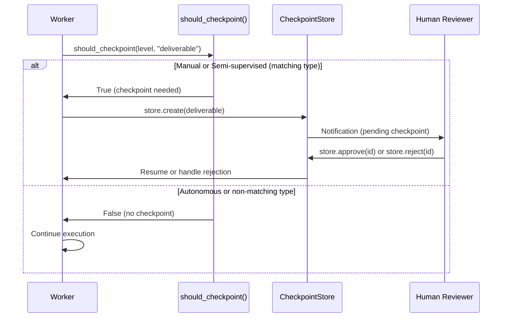

# Autonomy Levels and Checkpointing

## Contents

- [Module](#module)
- [Three Autonomy Levels](#three-autonomy-levels)
  - [AutonomyLevel Enum](#autonomylevel-enum)
  - [AutonomyConfig Model](#autonomyconfig-model)
- [Checkpoint Types](#checkpoint-types)
  - [Determining Whether to Checkpoint](#determining-whether-to-checkpoint)
- [Checkpoint Model](#checkpoint-model)
  - [CheckpointStatus Enum](#checkpointstatus-enum)
- [CheckpointStore](#checkpointstore)
- [Reviewers](#reviewers)
  - [AutoApproveReviewer](#autoapprovereviewer)
  - [PendingReviewer](#pendingreviewer)
- [Configuration](#configuration)
  - [Per-Worker (Tenant YAML)](#per-worker-tenant-yaml)
  - [Global Default (Environment Variable)](#global-default-environment-variable)
- [Flow Diagram](#flow-diagram)
- [Error Handling](#error-handling)
- [Related Documentation](#related-documentation)

---

firefly-dworkers provides configurable autonomy levels that control how much human oversight is required during worker execution. The checkpoint system allows human reviewers to approve or reject worker output at key points in a workflow.

---

## Module

```
firefly_dworkers.autonomy
```

Key components:

| Component | Module | Purpose |
|-----------|--------|---------|
| `AutonomyLevel` | `firefly_dworkers.types` | Enum of autonomy levels |
| `AutonomyConfig` | `firefly_dworkers.autonomy.levels` | Pydantic model for autonomy settings |
| `should_checkpoint()` | `firefly_dworkers.autonomy.levels` | Determine if a checkpoint is needed |
| `Checkpoint` | `firefly_dworkers.autonomy.checkpoint` | Dataclass representing a checkpoint |
| `CheckpointStatus` | `firefly_dworkers.autonomy.checkpoint` | Enum of checkpoint states |
| `CheckpointStore` | `firefly_dworkers.autonomy.checkpoint` | Thread-safe checkpoint storage |
| `AutoApproveReviewer` | `firefly_dworkers.autonomy.reviewer` | Reviewer that auto-approves everything |
| `PendingReviewer` | `firefly_dworkers.autonomy.reviewer` | Reviewer that creates pending checkpoints |

---

## Three Autonomy Levels

```
 +-------------+     +-------------------+     +--------------+
 |   MANUAL    |     | SEMI_SUPERVISED   |     |  AUTONOMOUS  |
 |             |     |                   |     |              |
 | Checkpoint  |     | Checkpoint at     |     | No           |
 | at EVERY    |     | phase transitions |     | checkpoints  |
 | step        |     | and deliverables  |     |              |
 +-------------+     +-------------------+     +--------------+
```

| Level | Value | Behavior |
|-------|-------|----------|
| Manual | `"manual"` | Every checkpoint type triggers a pause for human review |
| Semi-supervised | `"semi_supervised"` | Only `phase_transition`, `deliverable`, and `final_output` checkpoints trigger review |
| Autonomous | `"autonomous"` | No checkpoints; workers run without human intervention |

### AutonomyLevel Enum

The `AutonomyLevel` is a `StrEnum` defined in `firefly_dworkers.types`:

```python
from __future__ import annotations

from firefly_dworkers.types import AutonomyLevel

level = AutonomyLevel.SEMI_SUPERVISED
print(level.value)  # "semi_supervised"

# All members:
# AutonomyLevel.MANUAL          -> "manual"
# AutonomyLevel.SEMI_SUPERVISED -> "semi_supervised"
# AutonomyLevel.AUTONOMOUS      -> "autonomous"
```

### AutonomyConfig Model

The `AutonomyConfig` Pydantic model bundles a level with the set of checkpoint types that trigger review:

| Field | Type | Default | Description |
|-------|------|---------|-------------|
| `level` | `AutonomyLevel` | `SEMI_SUPERVISED` | The autonomy level |
| `checkpoint_types` | `frozenset[str]` | `{"phase_transition", "deliverable", "final_output"}` | Checkpoint types that trigger review in semi-supervised mode |

```python
from __future__ import annotations

from firefly_dworkers.autonomy.levels import AutonomyConfig
from firefly_dworkers.types import AutonomyLevel

config = AutonomyConfig(level=AutonomyLevel.MANUAL)
print(config.level)             # AutonomyLevel.MANUAL
print(config.checkpoint_types)  # frozenset({'phase_transition', 'deliverable', 'final_output'})
```

---

## Checkpoint Types

The system recognizes the following checkpoint types for semi-supervised mode:

| Checkpoint Type | Description |
|----------------|-------------|
| `phase_transition` | Worker is moving from one phase to another |
| `deliverable` | Worker has produced a deliverable artifact |
| `final_output` | Worker has completed its final output |

In manual mode, all checkpoint types trigger a pause. In autonomous mode, none do.

### Determining Whether to Checkpoint

```python
from __future__ import annotations

from firefly_dworkers.autonomy import should_checkpoint
from firefly_dworkers.types import AutonomyLevel

# Manual: always checkpoints
assert should_checkpoint(AutonomyLevel.MANUAL, "anything") is True

# Semi-supervised: only specific types
assert should_checkpoint(AutonomyLevel.SEMI_SUPERVISED, "phase_transition") is True
assert should_checkpoint(AutonomyLevel.SEMI_SUPERVISED, "deliverable") is True
assert should_checkpoint(AutonomyLevel.SEMI_SUPERVISED, "intermediate") is False

# Autonomous: never checkpoints
assert should_checkpoint(AutonomyLevel.AUTONOMOUS, "deliverable") is False
```

---

## Checkpoint Model

A `Checkpoint` is a dataclass representing a point where human review may be needed:

```python
from __future__ import annotations

from firefly_dworkers.autonomy import Checkpoint, CheckpointStatus

# Checkpoints are created by the CheckpointStore
# Fields:
#   id: str                          - Unique checkpoint ID
#   worker_name: str                 - Name of the worker
#   phase: str                       - Current phase/step
#   deliverable: Any                 - The output to review
#   status: CheckpointStatus         - PENDING, APPROVED, or REJECTED
#   rejection_reason: str            - Reason for rejection (if rejected)
#   created_at: datetime             - When the checkpoint was created
#   resolved_at: datetime | None     - When approved/rejected
```

### CheckpointStatus Enum

```python
from __future__ import annotations

from firefly_dworkers.autonomy import CheckpointStatus

CheckpointStatus.PENDING    # Waiting for review
CheckpointStatus.APPROVED   # Approved by reviewer
CheckpointStatus.REJECTED   # Rejected by reviewer
```

---

## CheckpointStore

Thread-safe storage for checkpoints:

```python
from __future__ import annotations

from firefly_dworkers.autonomy import CheckpointStore

store = CheckpointStore()

# Create a new checkpoint (generates UUID)
cp = store.create(
    deliverable="Draft market analysis report...",
    worker_name="analyst-acme-corp",
    phase="strategy-report",
)
print(f"Checkpoint ID: {cp.id}")
print(f"Status: {cp.status}")  # PENDING

# Or submit with a specific ID
cp = store.submit(
    "custom-id-123",
    deliverable="Draft report...",
    worker_name="analyst-acme-corp",
    phase="strategy-report",
)

# Check status
store.is_pending(cp.id)   # True
store.is_approved(cp.id)  # False
store.is_rejected(cp.id)  # False

# Approve
store.approve(cp.id)
store.is_approved(cp.id)  # True

# Or reject with reason
store.reject(cp.id, reason="Needs more competitor analysis")
store.is_rejected(cp.id)  # True

# Retrieve a checkpoint
cp = store.get(cp.id)

# List all pending checkpoints
pending = store.list_pending()

# Clear all (for testing)
store.clear()
```

---

## Reviewers

Reviewers implement the `CheckpointHandler` protocol:

```python
from __future__ import annotations

from typing import Any, Protocol, runtime_checkable


@runtime_checkable
class CheckpointHandler(Protocol):
    async def on_checkpoint(
        self, worker_name: str, phase: str, deliverable: Any
    ) -> bool: ...
```

The return value indicates whether the worker should continue (`True`) or pause (`False`).

### AutoApproveReviewer

Automatically approves all checkpoints. Used for autonomous mode or testing:

```python
from __future__ import annotations

from firefly_dworkers.autonomy import AutoApproveReviewer

reviewer = AutoApproveReviewer()
result = await reviewer.on_checkpoint("analyst", "report", "draft content")
# result is True -- always approves
```

### PendingReviewer

Creates a pending checkpoint in the store and returns `False` to pause execution:

```python
from __future__ import annotations

from firefly_dworkers.autonomy import CheckpointStore, PendingReviewer

store = CheckpointStore()
reviewer = PendingReviewer(store)

result = await reviewer.on_checkpoint("analyst", "report", "draft content")
# result is False -- execution pauses

# A checkpoint is now in the store
pending = store.list_pending()
print(f"Pending checkpoints: {len(pending)}")

# Human reviews and approves
store.approve(pending[0].id)
```

---

## Configuration

Autonomy is configured at two levels:

### Per-Worker (Tenant YAML)

```yaml
workers:
  analyst:
    autonomy: semi_supervised
  researcher:
    autonomy: autonomous
  data_analyst:
    autonomy: semi_supervised
  manager:
    autonomy: manual
```

### Global Default (Environment Variable)

```bash
export DWORKERS_DEFAULT_AUTONOMY=semi_supervised
```

Worker-level settings override the global default. If neither is specified, `semi_supervised` is used.

---

## Flow Diagram



---

## Error Handling

| Exception | When |
|-----------|------|
| `CheckpointError` | General checkpoint errors |
| `CheckpointRejectedError` | A checkpoint was rejected by the reviewer |

```python
from __future__ import annotations

from firefly_dworkers.exceptions import CheckpointRejectedError

try:
    # ... worker execution with checkpoints ...
    pass
except CheckpointRejectedError as e:
    print(f"Checkpoint rejected: {e}")
```

---

## Related Documentation

- [Workers Overview](../workers/overview.md) -- How workers use autonomy levels
- [Configuration](../configuration.md) -- Autonomy settings in tenant YAML
- [Plans Overview](../plans/overview.md) -- Checkpoints in plan execution
