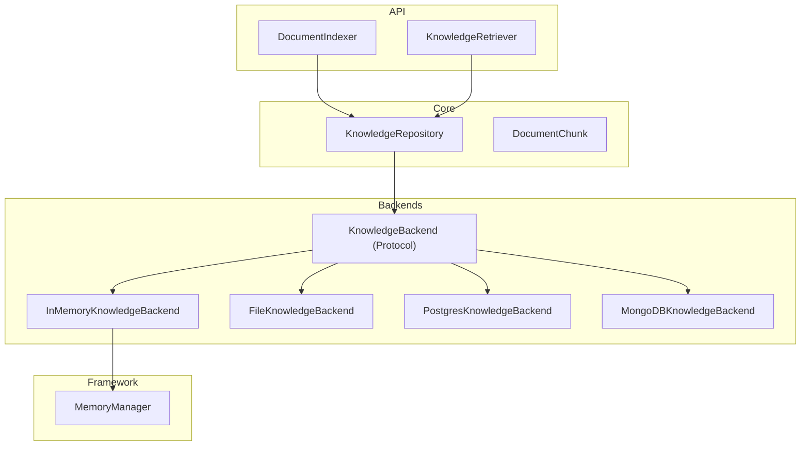

# Knowledge Layer

## Contents

- [Module](#module)
- [Architecture](#architecture)
- [KnowledgeBackend Protocol](#knowledgebackend-protocol)
  - [InMemoryKnowledgeBackend](#inmemoryknowledgebackend)
  - [Custom Backends](#custom-backends)
- [DocumentChunk](#documentchunk)
- [KnowledgeRepository](#knowledgerepository)
  - [Search](#search)
- [DocumentIndexer](#documentindexer)
- [KnowledgeRetriever](#knowledgeretriever)
- [Server Integration](#server-integration)
- [Configuration](#configuration)
- [Related Documentation](#related-documentation)

---

The knowledge layer provides document indexing and retrieval capabilities for digital workers. It supports pluggable storage backends via the `KnowledgeBackend` protocol.

---

## Module

```
firefly_dworkers.knowledge
```

Key classes:

| Class | Purpose |
|-------|---------|
| `KnowledgeBackend` | Protocol defining the storage interface |
| `InMemoryKnowledgeBackend` | Default adapter wrapping the framework's `MemoryManager` |
| `KnowledgeRepository` | High-level API for indexing, searching, and retrieving documents |
| `DocumentIndexer` | Splits raw text into overlapping chunks and indexes them |
| `KnowledgeRetriever` | Convenience layer for searching and formatting results |
| `DocumentChunk` | Pydantic model representing an indexed chunk |

---

## Architecture



---

## KnowledgeBackend Protocol

The `KnowledgeBackend` protocol defines four methods that any storage backend must implement:

```python
from __future__ import annotations

from typing import Any, Protocol, runtime_checkable


@runtime_checkable
class KnowledgeBackend(Protocol):
    def set_fact(self, key: str, value: Any) -> None: ...
    def get_fact(self, key: str) -> Any | None: ...
    def iter_items(self) -> list[tuple[str, Any]]: ...
    def clear_all(self) -> None: ...
```

This is a `runtime_checkable` protocol, meaning you can use `isinstance()` to verify conformance at runtime.

### InMemoryKnowledgeBackend

The default implementation wraps the framework's `MemoryManager`:

```python
from __future__ import annotations

from firefly_dworkers.knowledge import InMemoryKnowledgeBackend

backend = InMemoryKnowledgeBackend(scope_id="my-knowledge")
backend.set_fact("doc:report-1:0", {"chunk_id": "report-1:0", "content": "..."})
value = backend.get_fact("doc:report-1:0")

# Access the underlying MemoryManager for backward compatibility
mm = backend.memory
```

| Parameter | Type | Default | Description |
|-----------|------|---------|-------------|
| `memory` | `MemoryManager or None` | `None` | Existing `MemoryManager` to wrap. If `None`, a new one is created. |
| `scope_id` | `str` | `"knowledge"` | Scope ID passed to the new `MemoryManager` when `memory` is `None`. |

### Custom Backends

To create a custom backend, implement the four protocol methods:

```python
from __future__ import annotations

from typing import Any


class RedisKnowledgeBackend:
    """Knowledge backend backed by Redis."""

    def __init__(self, redis_url: str) -> None:
        import redis
        self._client = redis.from_url(redis_url)

    def set_fact(self, key: str, value: Any) -> None:
        import json
        self._client.set(key, json.dumps(value))

    def get_fact(self, key: str) -> Any | None:
        import json
        data = self._client.get(key)
        return json.loads(data) if data else None

    def iter_items(self) -> list[tuple[str, Any]]:
        import json
        items = []
        for key in self._client.keys("*"):
            value = self._client.get(key)
            if value:
                items.append((key.decode(), json.loads(value)))
        return items

    def clear_all(self) -> None:
        self._client.flushdb()
```

Pass it to `KnowledgeRepository`:

```python
from __future__ import annotations

from firefly_dworkers.knowledge import KnowledgeRepository

backend = RedisKnowledgeBackend("redis://localhost:6379/0")
repo = KnowledgeRepository(backend=backend)
```

---

## DocumentChunk

A Pydantic model representing an indexed chunk of document content:

```python
from __future__ import annotations

from firefly_dworkers.knowledge import DocumentChunk

chunk = DocumentChunk(
    chunk_id="report-2026:0",
    source="upload://strategy-report.pdf",
    content="Our 2026 strategy focuses on three growth pillars...",
    metadata={"author": "Strategy Team", "page": 1},
)
```

| Field | Type | Description |
|-------|------|-------------|
| `chunk_id` | `str` | Unique identifier for the chunk |
| `source` | `str` | Source identifier (e.g., `"sharepoint://doc/123"`, `"upload://report.pdf"`) |
| `content` | `str` | The text content of the chunk |
| `metadata` | `dict[str, Any]` | Arbitrary metadata (author, page, category, etc.) |

---

## KnowledgeRepository

The high-level API for document knowledge:

```python
from __future__ import annotations

from firefly_dworkers.knowledge import KnowledgeRepository, DocumentChunk

repo = KnowledgeRepository()

# Index a chunk
chunk = DocumentChunk(
    chunk_id="doc-1:0",
    source="upload://report.pdf",
    content="The market size for AI consulting is projected to reach...",
    metadata={"category": "market-research"},
)
repo.index(chunk)

# Retrieve by ID
result = repo.get("doc-1:0")

# Search by keyword (case-insensitive substring matching)
results = repo.search("AI consulting", max_results=10)

# List all unique sources
sources = repo.list_sources()

# Clear all indexed data
repo.clear()
```

| Method | Return Type | Description |
|--------|-------------|-------------|
| `index(chunk)` | `None` | Store a `DocumentChunk` under the key `doc:<chunk_id>` |
| `get(chunk_id)` | `DocumentChunk or None` | Retrieve a specific chunk by ID |
| `search(query, *, max_results=10)` | `list[DocumentChunk]` | Case-insensitive substring search |
| `list_sources()` | `list[str]` | Return sorted unique source identifiers |
| `clear()` | `None` | Remove all indexed knowledge |
| `memory` | `MemoryManager` | Backward-compatible access to the underlying `MemoryManager` (raises `AttributeError` if the backend is not memory-based) |

The constructor accepts either a `backend` (new pattern) or a bare `memory` `MemoryManager` (backward-compatible pattern). When `memory` is provided without `backend`, an `InMemoryKnowledgeBackend` adapter is created automatically.

### Search

The current search implementation uses case-insensitive substring matching. This is sufficient for MVP use cases. The protocol-based backend design allows upgrading to vector similarity search without changing the `KnowledgeRepository` API.

---

## DocumentIndexer

Splits raw text into overlapping chunks and indexes them:

```python
from __future__ import annotations

from firefly_dworkers.knowledge import DocumentIndexer, KnowledgeRepository

repo = KnowledgeRepository()
indexer = DocumentIndexer(chunk_size=1000, chunk_overlap=200)

chunk_ids = indexer.index_text(
    source="upload://strategy-report.pdf",
    text="<long document content here...>",
    metadata={"author": "Strategy Team"},
    repository=repo,
)
print(f"Indexed {len(chunk_ids)} chunks")
```

**Parameters:**

| Parameter | Type | Default | Description |
|-----------|------|---------|-------------|
| `chunk_size` | `int` | `1000` | Maximum characters per chunk |
| `chunk_overlap` | `int` | `200` | Overlap between consecutive chunks |

**Chunking logic:**

- If the text fits within `chunk_size`, a single chunk is created.
- Otherwise, the text is split into chunks of `chunk_size` characters with `chunk_overlap` characters of overlap between consecutive chunks.
- Chunk IDs follow the pattern `{source}:{index}` (e.g., `"upload://report.pdf:0"`, `"upload://report.pdf:1"`).

---

## KnowledgeRetriever

Convenience layer over `KnowledgeRepository` for common retrieval patterns:

```python
from __future__ import annotations

from firefly_dworkers.knowledge import KnowledgeRepository, KnowledgeRetriever

repo = KnowledgeRepository()
# ... index some documents ...

retriever = KnowledgeRetriever(repo)

# Basic retrieval (delegates to repo.search())
chunks = retriever.retrieve("market analysis", max_results=5)

# Retrieve all chunks from a specific source
# NOTE: This method accesses the underlying MemoryManager directly,
# so it requires an InMemoryKnowledgeBackend.
source_chunks = retriever.retrieve_by_source("upload://strategy-report.pdf")

# Get formatted context string for prompt injection
context = retriever.get_context_string("market analysis", max_results=5)
# Returns:
# ### upload://strategy-report.pdf
# The market size for AI consulting...
#
# ---
#
# ### upload://competitor-analysis.pdf
# Key competitors in the space include...
```

| Method | Return Type | Description |
|--------|-------------|-------------|
| `retrieve(query, *, max_results=5)` | `list[DocumentChunk]` | Search for chunks matching the query |
| `retrieve_by_source(source)` | `list[DocumentChunk]` | Get all chunks from a specific source (requires `InMemoryKnowledgeBackend`) |
| `get_context_string(query, *, max_results=5)` | `str` | Retrieve and format chunks as a markdown context string for prompt injection |

---

## Server Integration

The knowledge API endpoints (`/api/knowledge/index` and `/api/knowledge/search`) maintain per-tenant knowledge repositories. See [API Reference](../api-reference.md) for endpoint details.

---

## Configuration

The global `DworkersConfig.knowledge_backend` setting controls which backend type is used:

| Value | Backend |
|-------|---------|
| `in_memory` | `InMemoryKnowledgeBackend` (default) |
| `file` | File-based storage |
| `postgres` | PostgreSQL storage |
| `mongodb` | MongoDB storage |

Set via environment variable:

```bash
export DWORKERS_KNOWLEDGE_BACKEND=in_memory
```

---

## Related Documentation

- [Configuration](../configuration.md) -- Knowledge source configuration in tenant YAML
- [API Reference](../api-reference.md) -- Knowledge REST endpoints
- [Architecture](../architecture.md) -- Knowledge backend protocol diagram
