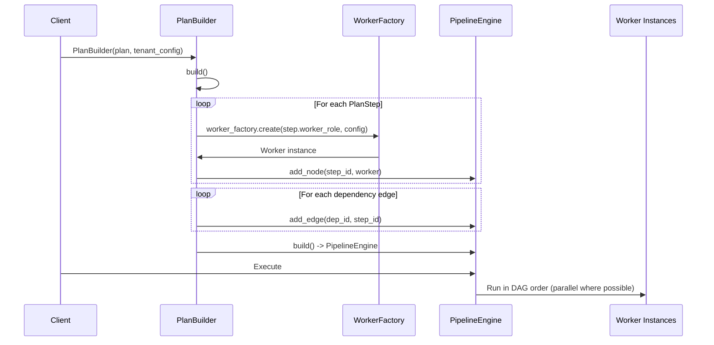

# Plans Overview

## Contents

- [What are Plans?](#what-are-plans)
- [Core Concepts](#core-concepts)
- [Plan Execution Flow](#plan-execution-flow)
- [Built-in Templates](#built-in-templates)
- [Related Documentation](#related-documentation)

---

## What are Plans?

Plans are reusable DAG-based workflow templates that coordinate multiple workers to complete multi-step consulting engagements. Each plan defines a directed acyclic graph (DAG) of steps, where each step specifies which worker role executes it and which other steps it depends on.

---

## Core Concepts

### BasePlan

`BasePlan` (`firefly_dworkers.plans.base`) is the container for a plan template:

```python
from firefly_dworkers.plans.base import BasePlan, PlanStep
from firefly_dworkers.types import WorkerRole

plan = BasePlan(
    "my-analysis",
    description="Custom analysis workflow",
)
plan.add_step(
    PlanStep(
        step_id="research",
        name="Research Phase",
        worker_role=WorkerRole.RESEARCHER,
    )
)
```

**Properties:**

| Property | Type | Description |
|----------|------|-------------|
| `name` | `str` | Unique plan identifier |
| `description` | `str` | Human-readable description |
| `steps` | `list[PlanStep]` | Ordered list of plan steps |

### PlanStep

Each step in a plan is a `PlanStep` with these fields:

| Field | Type | Description |
|-------|------|-------------|
| `step_id` | `str` | Unique identifier within the plan |
| `name` | `str` | Human-readable step name |
| `description` | `str` | What this step does |
| `worker_role` | `WorkerRole` | Which worker role executes this step |
| `prompt_template` | `str` | Jinja2 or f-string template for the worker's input |
| `depends_on` | `list[str]` | Step IDs that must complete before this step runs |
| `retry_max` | `int` | Maximum retry attempts (0 = no retries) |
| `timeout_seconds` | `float` | Execution timeout (0 = no timeout) |

### PlanBuilder

`PlanBuilder` (`firefly_dworkers.plans.builder`) converts a `BasePlan` + `TenantConfig` into an executable `PipelineEngine`:

```python
from firefly_dworkers.plans.builder import PlanBuilder
from firefly_dworkers.tenants.registry import tenant_registry

config = tenant_registry.get("acme-corp")
builder = PlanBuilder(plan, config)
engine = builder.build()
result = await engine.run(inputs={"brief": "Analyze the AI market"})
```

The builder:
1. Iterates over each `PlanStep`
2. Creates a worker instance via `WorkerFactory` for each step's role
3. Adds each worker as a node in a `PipelineBuilder` DAG
4. Wires dependency edges from `depends_on` relationships
5. Returns a `PipelineEngine` ready for execution

### PlanRegistry

`PlanRegistry` (`firefly_dworkers.plans.registry`) is a thread-safe singleton that stores plan templates by name:

```python
from firefly_dworkers.plans.registry import plan_registry

# Register a plan
plan_registry.register(plan)

# Retrieve by name
plan = plan_registry.get("market-analysis")

# List all plans
names = plan_registry.list_plans()
```

---

## Plan Execution Flow



Steps without dependency relationships execute in parallel. Steps with `depends_on` wait for their dependencies to complete before running.

---

## Built-in Templates

firefly-dworkers ships with four plan templates. See [Templates](templates.md) for full details.

| Template | Steps | Workers Used |
|----------|-------|-------------|
| `market-analysis` | 6 | Analyst, Researcher, Data Analyst, Manager |
| `customer-segmentation` | 5 | Analyst, Researcher, Data Analyst, Manager |
| `process-improvement` | 6 | Analyst, Researcher, Data Analyst, Manager |
| `technology-assessment` | 6 | Analyst, Researcher, Data Analyst, Manager |

---

## Related Documentation

- [Plan Templates](templates.md) — Built-in template reference with DAG diagrams
- [Custom Plans](custom-plans.md) — Guide for creating your own plans
- [Architecture](../architecture.md) — Plan DAG execution in the architecture overview
- [Workers Overview](../workers/overview.md) — Worker roles used by plans
