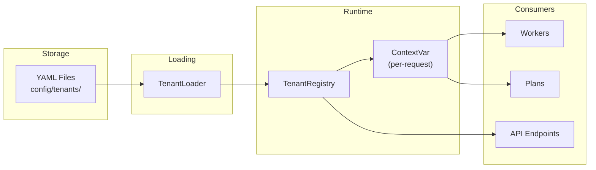

# Multi-Tenancy Overview

## Contents

- [Module](#module)
- [Architecture](#architecture)
- [TenantConfig](#tenantconfig)
  - [Sub-Models](#sub-models)
- [Loading Tenants](#loading-tenants)
  - [From a Single File](#from-a-single-file)
  - [From a Directory](#from-a-directory)
- [TenantRegistry](#tenantregistry)
- [Tenant Context (ContextVar)](#tenant-context-contextvar)
- [Per-Role Worker Settings](#per-role-worker-settings)
- [Connector Configuration](#connector-configuration)
  - [Querying Connectors](#querying-connectors)
  - [Web Browser Connector](#web-browser-connector)
- [Error Handling](#error-handling)
- [Related Documentation](#related-documentation)

---

firefly-dworkers is multi-tenant by design. Each tenant (typically a client organization) has its own configuration defining models, worker settings, connectors, verticals, and knowledge sources. Tenants are onboarded through YAML files with no code changes required.

---

## Module

```
firefly_dworkers.tenants
```

Key components:

| Component | Module | Purpose |
|-----------|--------|---------|
| `TenantConfig` | `firefly_dworkers.tenants.config` | Pydantic model for tenant configuration |
| `TenantRegistry` | `firefly_dworkers.tenants.registry` | Thread-safe registry for tenant configs |
| `tenant_registry` | `firefly_dworkers.tenants.registry` | Module-level singleton |
| `load_tenant_config()` | `firefly_dworkers.tenants.loader` | Load a single YAML/JSON file |
| `load_all_tenants()` | `firefly_dworkers.tenants.loader` | Load all configs from a directory |
| `set_current_tenant()` | `firefly_dworkers.tenants.context` | Set tenant in current async context |
| `get_current_tenant()` | `firefly_dworkers.tenants.context` | Get tenant from current async context |
| `reset_current_tenant()` | `firefly_dworkers.tenants.context` | Reset tenant context |

---

## Architecture



---

## TenantConfig

The `TenantConfig` is a Pydantic `BaseModel` with the following structure:

```python
from __future__ import annotations

from firefly_dworkers.tenants.config import TenantConfig

config = TenantConfig(
    id="acme-corp",
    name="Acme Corporation",
    models=...,          # ModelsConfig
    verticals=["banking", "technology"],
    workers=...,         # WorkerConfig
    connectors=...,      # ConnectorsConfig
    knowledge=...,       # KnowledgeConfig
    branding=...,        # BrandingConfig
    security=...,        # SecurityConfig
)
```

### Sub-Models

| Model | Fields | Purpose |
|-------|--------|---------|
| `ModelsConfig` | `default`, `research`, `analysis` | LLM model selection |
| `WorkerConfig` | `analyst`, `researcher`, `data_analyst`, `manager` | Per-role settings |
| `WorkerConfig.WorkerSettings` | `enabled`, `autonomy`, `custom_instructions`, `max_concurrent_tasks` | Individual worker config |
| `ConnectorsConfig` | One field per connector type | Connector credentials and settings |
| `KnowledgeConfig` | `sources` | Knowledge source definitions |
| `KnowledgeSourceConfig` | `type`, `url`, `metadata` | Individual knowledge source entry |
| `BrandingConfig` | `company_name`, `report_template`, `logo_url` | Branding settings |
| `SecurityConfig` | `allowed_models`, `data_residency`, `encryption_enabled` | Security constraints |

---

## Loading Tenants

### From a Single File

```python
from __future__ import annotations

from firefly_dworkers.tenants import load_tenant_config

config = load_tenant_config("config/tenants/acme-corp.yaml")
print(f"Tenant: {config.id} ({config.name})")
```

The loader supports both YAML and JSON. If the file contains a top-level `tenant` key, it is automatically unwrapped:

```yaml
# Both formats are valid:

# Format 1: Direct
id: acme-corp
name: Acme Corporation

# Format 2: Nested under "tenant"
tenant:
  id: acme-corp
  name: Acme Corporation
```

### From a Directory

```python
from __future__ import annotations

from firefly_dworkers.tenants import load_all_tenants

configs = load_all_tenants("config/tenants/")
for config in configs:
    print(f"  {config.id}: {config.name}")
```

Files are loaded in alphabetical order. Only `.yaml`, `.yml`, and `.json` files are processed.

---

## TenantRegistry

The `TenantRegistry` provides thread-safe storage and lookup for tenant configurations:

```python
from __future__ import annotations

from firefly_dworkers.tenants import tenant_registry, load_all_tenants

# Load and register all tenants
for config in load_all_tenants("config/tenants/"):
    tenant_registry.register(config)

# Lookup
config = tenant_registry.get("acme-corp")

# Check existence
exists = tenant_registry.has("acme-corp")

# List all tenant IDs
ids = tenant_registry.list_tenants()

# Remove a tenant
tenant_registry.unregister("acme-corp")

# Clear all (for testing)
tenant_registry.clear()
```

---

## Tenant Context (ContextVar)

For async server environments, the current tenant is stored in a `ContextVar` for per-request isolation:

```python
from __future__ import annotations

from firefly_dworkers.tenants import (
    get_current_tenant,
    set_current_tenant,
    reset_current_tenant,
)

# Set the tenant for the current async context
token = set_current_tenant(config)

try:
    # Any code in this context can access the current tenant
    tenant = get_current_tenant()
    print(f"Processing request for tenant: {tenant.id}")
finally:
    # Reset when done (important for context cleanup)
    reset_current_tenant(token)
```

This is typically used in middleware or dependency injection:

```python
from __future__ import annotations

from fastapi import Depends, Request


async def get_tenant(request: Request):
    """FastAPI dependency that resolves the tenant from the request."""
    tenant_id = request.headers.get("X-Tenant-ID", "default")
    config = tenant_registry.get(tenant_id)
    token = set_current_tenant(config)
    try:
        yield config
    finally:
        reset_current_tenant(token)
```

---

## Per-Role Worker Settings

The `WorkerConfig` provides per-role settings accessible via `settings_for(role)`:

```python
from __future__ import annotations

from firefly_dworkers.tenants import load_tenant_config

config = load_tenant_config("config/tenants/acme-corp.yaml")

analyst_settings = config.workers.settings_for("analyst")
print(f"Autonomy: {analyst_settings.autonomy}")
print(f"Enabled: {analyst_settings.enabled}")
print(f"Custom instructions: {analyst_settings.custom_instructions}")
print(f"Max concurrent: {analyst_settings.max_concurrent_tasks}")
```

---

## Connector Configuration

Each connector has a typed Pydantic model that inherits from `BaseConnectorConfig`. All connector configs share these base fields:

| Field | Type | Default | Description |
|-------|------|---------|-------------|
| `enabled` | `bool` | `False` | Whether the connector is active |
| `provider` | `str` | `""` | Provider hint |
| `credential_ref` | `str` | `""` | Reference to a vault credential |
| `timeout` | `float` | `30.0` | Request timeout in seconds |

The `ConnectorsConfig` class holds one field per connector type:

| Field | Config Class | Description |
|-------|-------------|-------------|
| `web_search` | `WebSearchConnectorConfig` | Web search provider (Tavily, etc.) |
| `web_browser` | `WebBrowserConnectorConfig` | Web browser automation (HTTP+BS4 or FlyBrowser) |
| `sharepoint` | `SharePointConnectorConfig` | SharePoint adapter |
| `google_drive` | `GoogleDriveConnectorConfig` | Google Drive adapter |
| `confluence` | `ConfluenceConnectorConfig` | Confluence adapter |
| `s3` | `S3ConnectorConfig` | Amazon S3 adapter |
| `jira` | `JiraConnectorConfig` | Jira adapter |
| `asana` | `AsanaConnectorConfig` | Asana adapter |
| `slack` | `SlackConnectorConfig` | Slack adapter |
| `teams` | `TeamsConnectorConfig` | Microsoft Teams adapter |
| `email` | `EmailConnectorConfig` | Email (SMTP/IMAP) adapter |
| `sql` | `SQLConnectorConfig` | SQL database connector |
| `api` | `APIConnectorConfig` | Generic HTTP API connector |

### Querying Connectors

The `ConnectorsConfig.enabled_connectors()` method returns only connectors with `enabled=True`. The `get_connector(name)` method retrieves a specific connector config by name.

```python
from __future__ import annotations

from firefly_dworkers.tenants import load_tenant_config

config = load_tenant_config("config/tenants/acme-corp.yaml")

# Get all enabled connectors
enabled = config.connectors.enabled_connectors()
for name, cfg in enabled.items():
    print(f"{name}: provider={cfg.provider}, timeout={cfg.timeout}")

# Access a specific connector by attribute
web_cfg = config.connectors.web_search
print(f"Web search provider: {web_cfg.provider}")
print(f"API key set: {bool(web_cfg.api_key)}")

# Access a specific connector by name
browser_cfg = config.connectors.get_connector("web_browser")
print(f"Browser provider: {browser_cfg.provider}")
```

### Web Browser Connector

The `WebBrowserConnectorConfig` controls which browser backend is used by web tools. It supports two providers: `"web_browser"` for a lightweight HTTP+BeautifulSoup4 adapter, or `"flybrowser"` for LLM-powered browser automation.

| Field | Type | Default | Description |
|-------|------|---------|-------------|
| `provider` | `str` | `"web_browser"` | Backend: `"web_browser"` or `"flybrowser"` |
| `llm_provider` | `str` | `"openai"` | LLM provider for FlyBrowser |
| `llm_model` | `str` | `""` | LLM model name for FlyBrowser |
| `llm_api_key` | `str` | `""` | API key for the LLM provider |
| `headless` | `bool` | `True` | Run browser in headless mode |
| `speed_preset` | `str` | `"balanced"` | Speed preset: `"fast"`, `"balanced"`, or `"thorough"` |

YAML example:

```yaml
connectors:
  web_browser:
    enabled: true
    provider: "flybrowser"
    llm_provider: "openai"
    llm_model: "gpt-4o"
    headless: true
    speed_preset: "fast"
```

---

## Error Handling

| Exception | When |
|-----------|------|
| `TenantError` | Configuration file not found, unsupported format, or invalid data |
| `TenantNotFoundError` | Tenant ID not found in the registry |

```python
from __future__ import annotations

from firefly_dworkers.exceptions import TenantNotFoundError
from firefly_dworkers.tenants import tenant_registry

try:
    config = tenant_registry.get("nonexistent")
except TenantNotFoundError as e:
    print(e)  # "Tenant 'nonexistent' not registered"
```

---

## Related Documentation

- [Configuration Reference](../configuration.md) -- Complete tenant YAML schema
- [Workers Overview](../workers/overview.md) -- How workers use tenant config
- [Architecture](../architecture.md) -- Tenant configuration flow diagram
