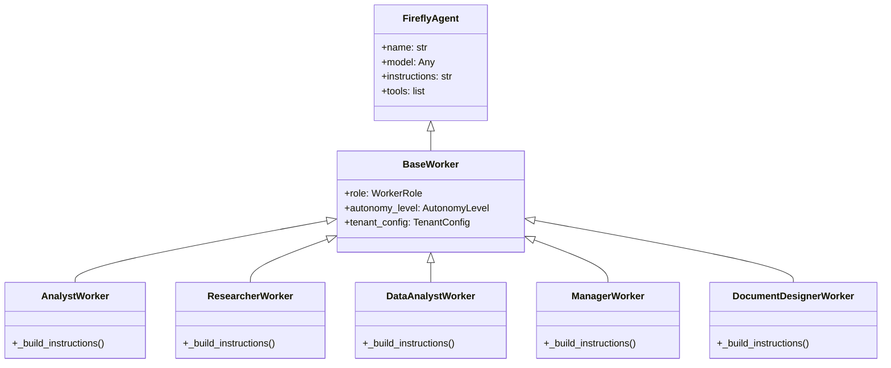

# Workers Overview

## Contents

- [Worker Roles](#worker-roles)
- [Worker Architecture](#worker-architecture)
- [BaseWorker](#baseworker)
- [Instruction Building](#instruction-building)
- [Guard and Cost Middleware](#guard-and-cost-middleware)
- [Prompt Templates](#prompt-templates)
- [Worker Toolkits](#worker-toolkits)
- [WorkerFactory](#workerfactory)
- [WorkerRegistry](#workerregistry)
- [Worker Lifecycle](#worker-lifecycle)
- [Related Documentation](#related-documentation)

---

Workers are the central abstraction in firefly-dworkers. Each worker is an AI agent specialized for a specific consulting role, equipped with role-appropriate tools and instructions.

---

## Worker Roles

firefly-dworkers provides five built-in worker roles, defined in `firefly_dworkers.types.WorkerRole` (a `StrEnum`):

| Enum Member | String Value | Class | Module | Description |
|-------------|-------------|-------|--------|-------------|
| `WorkerRole.RESEARCHER` | `"researcher"` | `ResearcherWorker` | `firefly_dworkers.workers.researcher` | Market research, competitive analysis, trend identification, literature reviews |
| `WorkerRole.ANALYST` | `"analyst"` | `AnalystWorker` | `firefly_dworkers.workers.analyst` | Business process analysis, requirement gathering, gap analysis, recommendations |
| `WorkerRole.DATA_ANALYST` | `"data_analyst"` | `DataAnalystWorker` | `firefly_dworkers.workers.data_analyst` | Spreadsheet processing, database queries, API data retrieval, statistical analysis |
| `WorkerRole.MANAGER` | `"manager"` | `ManagerWorker` | `firefly_dworkers.workers.manager` | Task coordination, timeline management, deliverable tracking, stakeholder communication |
| `WorkerRole.DESIGNER` | `"designer"` | `DocumentDesignerWorker` | `firefly_dworkers.workers.designer` | Presentation creation, document formatting, spreadsheet styling, visual deliverables |

---

## Worker Architecture

All workers extend `BaseWorker`, which in turn extends `FireflyAgent` from the framework:



---

## BaseWorker

`BaseWorker` (`firefly_dworkers.workers.base`) extends `FireflyAgent` and adds three concerns:

1. **Role** -- A `WorkerRole` enum value identifying the worker's specialization.
2. **Autonomy level** -- Resolved from the tenant config's per-role worker settings, or overridden explicitly.
3. **Tenant configuration** -- The `TenantConfig` instance bound to this worker, used for model resolution and connector access.

Constructor signature:

```python
from __future__ import annotations

from typing import Any

from fireflyframework_genai.agents.base import FireflyAgent

from firefly_dworkers.tenants.config import TenantConfig
from firefly_dworkers.types import AutonomyLevel, WorkerRole


class BaseWorker(FireflyAgent):
    def __init__(
        self,
        name: str,
        *,
        role: WorkerRole,
        tenant_config: TenantConfig,
        model: Any = "",
        autonomy_level: AutonomyLevel | None = None,
        instructions: str | Any = "",
        tools: Any = (),
        auto_register: bool = False,
        **kwargs: Any,
    ) -> None:
        ...
```

**Parameters:**

| Parameter | Type | Default | Description |
|-----------|------|---------|-------------|
| `name` | `str` | (required) | Unique worker name |
| `role` | `WorkerRole` | (required) | The worker's role enum value |
| `tenant_config` | `TenantConfig` | (required) | Tenant-level configuration |
| `model` | `Any` | `""` | Model string or instance; falls back to `tenant_config.models.default` |
| `autonomy_level` | `AutonomyLevel \| None` | `None` | Explicit override; otherwise read from tenant per-role settings |
| `instructions` | `str \| Any` | `""` | System prompt text |
| `tools` | `Any` | `()` | Sequence of tools or toolkits |
| `auto_register` | `bool` | `False` | Whether to register in the framework AgentRegistry |
| `**kwargs` | `Any` | -- | Forwarded to `FireflyAgent` |

**Properties:**

| Property | Type | Description |
|----------|------|-------------|
| `role` | `WorkerRole` | The worker's role |
| `autonomy_level` | `AutonomyLevel` | The worker's resolved autonomy level |
| `tenant_config` | `TenantConfig` | The tenant configuration bound to this worker |

**Model resolution:** If no model is passed, `BaseWorker` uses `tenant_config.models.default`.

**Autonomy resolution:** If no `autonomy_level` is passed, it reads the per-role setting from `tenant_config.workers.settings_for(role.value)`.

---

## Instruction Building

Each worker class defines a static `_build_instructions()` method that constructs the system prompt. The process follows three steps:

1. Start with a **role-specific base prompt** (e.g., "You are an expert consulting analyst...").
2. Append **vertical fragments** for each vertical listed in the tenant config.
3. Append **custom instructions** from the tenant's per-role worker settings.

Example from `AnalystWorker`:

```python
from __future__ import annotations

from firefly_dworkers.tenants.config import TenantConfig
from firefly_dworkers.verticals import get_vertical


@staticmethod
def _build_instructions(config: TenantConfig) -> str:
    parts: list[str] = [
        "You are an expert consulting analyst. Your role is to analyze "
        "business processes, gather requirements, identify gaps, and "
        "produce actionable recommendations.",
    ]

    # Add vertical-specific fragments
    for v_name in config.verticals:
        v = get_vertical(v_name)
        parts.append(v.system_prompt_fragment)

    # Add custom instructions from tenant config
    settings = config.workers.settings_for("analyst")
    if settings.custom_instructions:
        parts.append(settings.custom_instructions)

    return "\n\n".join(parts)
```

Each built-in worker follows this same pattern with a different base prompt appropriate to its role.

---

## Guard and Cost Middleware

`BaseWorker` automatically wires guard and cost middleware from the tenant's security and observability configuration:

1. **Guard middleware** -- Built from `tenant_config.security.guards`:
   - `PromptGuardMiddleware` when `prompt_guard_enabled=True`
   - `OutputGuardMiddleware` when `output_guard_enabled=True`
2. **Cost middleware** -- Built from `tenant_config.observability`:
   - `CostGuardMiddleware` when `cost_budget_usd > 0`
3. **User middleware** -- Any middleware passed via the `middleware` kwarg.

Middleware ordering: guard middleware -> cost middleware -> user middleware. The framework also auto-wires `LoggingMiddleware` and `ObservabilityMiddleware`.

---

## Prompt Templates

Worker instructions are loaded from Jinja2 templates via the prompt management system:

```python
from __future__ import annotations

from firefly_dworkers.prompts import get_worker_prompt

prompt = get_worker_prompt(
    "analyst",
    company_name="Acme Corp",
    verticals="banking, technology",
)
```

Templates are located in `src/firefly_dworkers/prompts/workers/` and support Jinja2 variables for tenant-specific customization (company name, verticals, custom instructions).

---

## Worker Toolkits

Each worker receives a `ToolKit` assembled by functions in `firefly_dworkers.tools.toolkits`:

| Worker | Toolkit Function | Tools Included |
|--------|-----------------|----------------|
| Analyst | `analyst_toolkit()` | Storage connectors, communication connectors, presentation tools, document tools, requirement gathering, process mapping, gap analysis, report generation, documentation |
| Researcher | `researcher_toolkit()` | Web search/browsing (with FallbackComposer), storage connectors, report generation, RSS feeds, research chain (SequentialComposer) |
| Data Analyst | `data_analyst_toolkit()` | Storage connectors, spreadsheet tools, data tools (SQL), vision analysis, spreadsheet parsing, API client, report generation |
| Manager | `manager_toolkit()` | Project management tools (Jira, Asana), communication connectors, presentation tools, document tools, spreadsheet tools, vision analysis, report generation, documentation |
| Designer | `designer_toolkit()` | Presentation tools, document tools, spreadsheet tools, vision analysis, storage connectors |

The toolkits are assembled dynamically based on the tenant's enabled connectors. If SharePoint is disabled in the tenant config, no SharePoint tool is included in the toolkit.

---

## WorkerFactory

The `WorkerFactory` (`firefly_dworkers.workers.factory`) maps `WorkerRole` values to worker classes using a decorator-based registration pattern, mirroring how `ToolRegistry` works for tools.

**Registration** happens at class definition time via the `@worker_factory.register()` decorator:

```python
from __future__ import annotations

from firefly_dworkers.workers.factory import worker_factory
from firefly_dworkers.workers.base import BaseWorker
from firefly_dworkers.types import WorkerRole


@worker_factory.register(WorkerRole.ANALYST)
class AnalystWorker(BaseWorker):
    ...
```

**Creation** uses the `create` method, which passes `tenant_config` as the first positional argument to the worker constructor:

```python
from __future__ import annotations

from firefly_dworkers.tenants import load_tenant_config
from firefly_dworkers.types import WorkerRole
from firefly_dworkers.workers.factory import worker_factory

config = load_tenant_config("config/tenants/acme-corp.yaml")
worker = worker_factory.create(
    WorkerRole.ANALYST,
    config,
    name="market-analyst",
)
```

The factory is thread-safe (uses `threading.Lock`) and provides the following API:

| Method | Signature | Description |
|--------|-----------|-------------|
| `register` | `register(role: WorkerRole) -> decorator` | Decorator that registers a worker class for a role. Raises `ValueError` if the role is already registered to a different class. |
| `create` | `create(role, tenant_config, **kwargs) -> BaseWorker` | Instantiate the worker registered for the given role. Raises `KeyError` if no worker is registered. |
| `get_class` | `get_class(role) -> type` | Return the raw class without instantiating. Raises `KeyError` if not registered. |
| `has` | `has(role) -> bool` | Check if a worker is registered for the role. |
| `list_roles` | `list_roles() -> list[WorkerRole]` | Return all registered roles. |
| `clear` | `clear() -> None` | Remove all registrations (primarily used in testing). |

The module also exposes a singleton instance:

```python
from firefly_dworkers.workers.factory import worker_factory
```

---

## WorkerRegistry

The `WorkerRegistry` (`firefly_dworkers.workers.registry`) stores worker _instances_ by name:

```python
from __future__ import annotations

from firefly_dworkers.workers import worker_registry

# Register an instance
worker_registry.register(worker)

# Retrieve by name
worker = worker_registry.get("market-analyst")

# List all registered workers
names = worker_registry.list_workers()
```

This is separate from `WorkerFactory` (which stores classes) and provides instance-level management for running workers.

---

## Worker Lifecycle

1. **Configuration** -- Load `TenantConfig` from YAML.
2. **Creation** -- `WorkerFactory.create()` instantiates the worker, resolving the model and building instructions.
3. **Toolkit assembly** -- The toolkit factory builds a `ToolKit` from enabled connectors.
4. **Registration** -- Optionally register in `WorkerRegistry` for name-based lookup.
5. **Execution** -- Worker processes prompts through the framework's agent execution pipeline.
6. **Checkpointing** -- Based on autonomy level, checkpoints may pause execution for human review.

---

### DocumentDesignerWorker

**Role:** `WorkerRole.DESIGNER`

The designer worker transforms structured content into polished deliverables.
It makes all design decisions: layout selection, color schemes, typography,
chart types, image placement, and visual hierarchy.

**Capabilities:**
- Analyze reference templates for design DNA (colors, fonts, layouts)
- Generate autonomous design profiles when no reference is provided
- Create presentations, documents, spreadsheets, and PDFs
- Embed charts, images, and diagrams
- Apply consistent styling across all pages

**Toolkit:** `designer_toolkit` — includes presentation, document, spreadsheet, vision, and storage tools.

---

## Related Documentation

- [Custom Workers](custom-workers.md) -- How to create custom worker classes
- [Tools Overview](../tools/overview.md) -- The tool system that powers workers
- [Autonomy](../autonomy/overview.md) -- Autonomy levels and checkpoint handling
- [Verticals](../verticals/overview.md) -- Industry-specific instruction fragments
